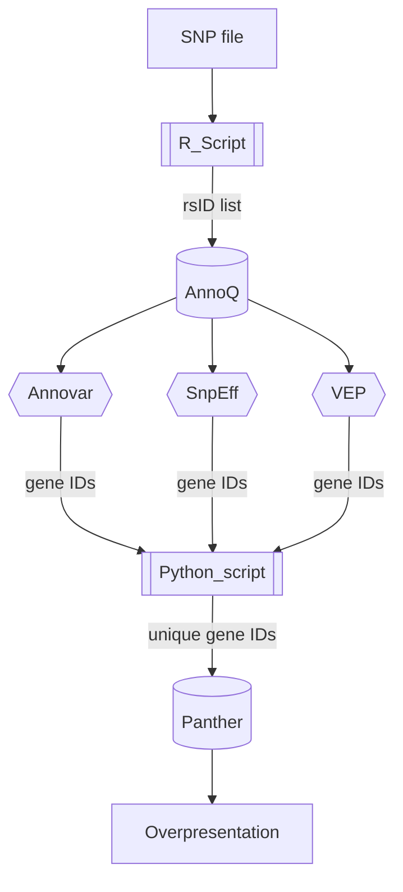

# SNP to rsID to Overrepresentation 

Workflow for mapping SNPs to rsID to performing overrepresentation analysis 

```mermaid
flowchart TD

A[SNP file] --> B[[R_Script]]
B --> |rsID list| C[(AnnoQ)]
C --> D{{Annovar}} & E{{SnpEff}} & F{{VEP}}
D & E & F ---> |gene IDs| G[[Python_script]] 
G --> |unique gene IDs| H[(Panther)]
H --> I[Overpresentation]

click C "http://annoq.org/" _blank
click H "http://pantherdb.org/" _blank

```
