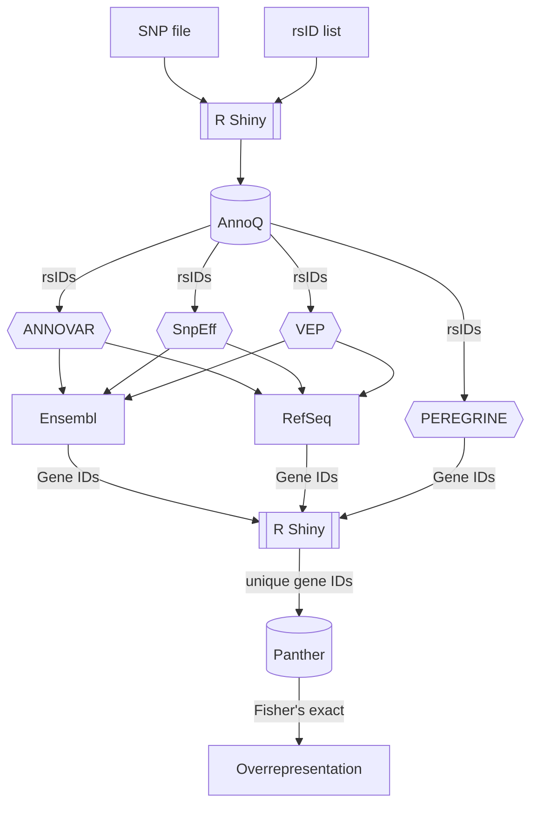

# SNP to rsID to Overrepresentation 

Workflow for mapping SNPs to rsID to performing overrepresentation analysis 

The pipeline allows for the user to start from a list of SNPs (Version Seq37) or from a list of rsID. 

If you start from the list of SNPs, please refer to SNPs_Seq37_example.csv to see the input format that the R program accepts (this can be modified by the user). 
Next, you will receive a list of rsID from the R program. 

The rsID list will need to be run through [ANNOQ](annoq.org) to obtain the geneIDs for the SNPs. 

Using the Python script you will be able to obtain the unique list of gene IDs, which you will run through [Panther](pantherdb.org).

[Panther](pantherdb.org) will perform a Fisher's exact test to find any overrepresentation in your input list. 

